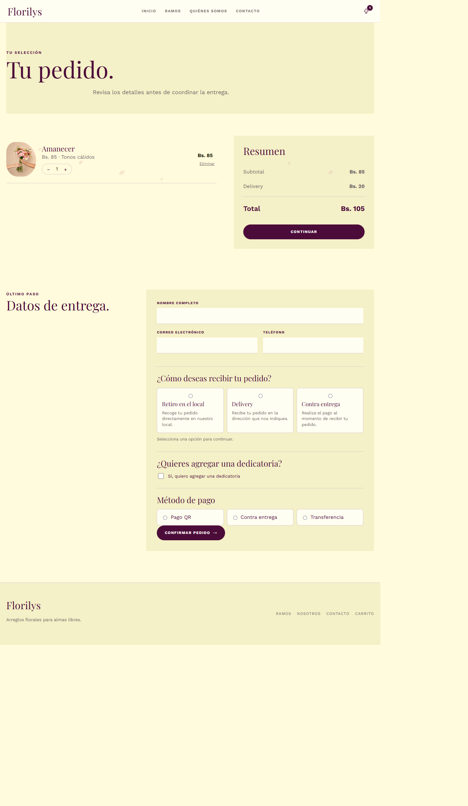

# Florilys

SPA para una florería, construida con React 19 y Vite. La interfaz y el contenido están en español; los productos e imágenes se sirven localmente.

## Enlaces

- Repositorio: https://github.com/achacollonietomaria/pagina-web-florilys-foro-3
- Sitio publicado: https://pagina-web-florilys-foro-3.netlify.app/

## Ejecutar

Requiere Node.js y npm:

```sh
npm install
npm run dev
```

Para validar la compilación y el estilo:

```sh
npm run build
npm run lint
```

## Publicar en Netlify

Configura el sitio con estos valores:

- Comando de build: `npm run build`
- Directorio de publicación: `dist`
- Directorio base: vacío

El archivo `public/_redirects` se copia durante el build y redirige las rutas de la SPA a `index.html`, para que las rutas internas funcionen también al abrirlas directamente.

## Estructura de la SPA

- `src/main.jsx`: monta React en `#root`.
- `src/AppRoot.jsx`: coordina rutas con History API, estado compartido del carrito y pedido.
- `src/pages/`: vistas de inicio, catálogo, detalle, carrito, contacto y nosotros.
- `src/components/`: piezas reutilizables de presentación, navegación y catálogo.
- `src/data/products.js`: catálogo local de productos.
- `src/legacy.css` y `src/florilys.css`: estilos de la interfaz actual.

Las rutas principales son `/`, `/productos`, `/detalle?id=amanecer`, `/carrito`, `/nosotros` y `/contacto`. La navegación interna actualiza la URL sin recargar la SPA.

## Decisión técnica: persistir el carrito en `localStorage`

**Escenario anterior:** si el carrito existiera solo en el estado en memoria de React, navegar dentro de la SPA lo conservaría, pero recargar la página o cerrar y volver a abrir la pestaña lo vaciaría.

**Alternativa elegida y aplicada:** `AppRoot` conserva el carrito en estado compartido y lo inicializa desde la clave `florilys_cart` de `localStorage`. Cada cambio del carrito se guarda de nuevo. La estructura se valida al leer para descartar elementos inválidos sin impedir que la SPA se renderice; los errores de lectura o escritura se registran explícitamente en la consola.

**Razón:** el estado compartido mantiene sincronizados el contador del encabezado y la vista del carrito; `localStorage` permite continuar el pedido tras una recarga en el mismo navegador, sin añadir dependencias ni un servicio externo. La persistencia es local al navegador y no sincroniza dispositivos.

**Verificación realizada:** `npm run build` y `npm run lint` finalizaron correctamente. En el navegador agregué “Amanecer”, abrí `/carrito` y recargué la página; el producto, la cantidad y el contador siguieron presentes. También probé JSON malformado en `florilys_cart`: la SPA mostró el estado vacío sin romperse y registró el error en la consola. En las herramientas de desarrollo del navegador, en *Application/Almacenamiento > Local Storage*, se puede comprobar que `florilys_cart` contiene el estado serializado. Al cambiar la cantidad o eliminar el ramo, el valor debe actualizarse.

**Prueba adicional propuesta:** guardar una lista con un producto válido y otro con cantidad `0` en `florilys_cart`, luego recargar. El producto válido debe conservarse, el elemento incorrecto debe omitirse y la consola debe registrar la validación.

## Evidencia

La captura siguiente muestra el carrito con un producto después de recargar la página:


